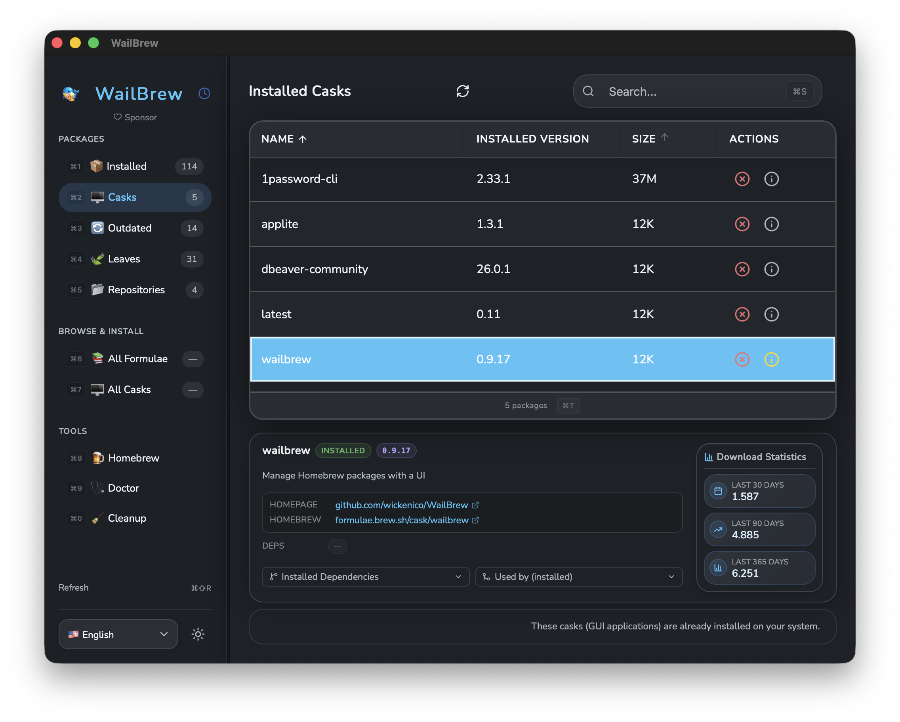

# WailBrew - Homebrew GUI Manager

[](https://github.com/wickenico/WailBrew/releases/latest)
[](https://github.com/wickenico/WailBrew/releases)

## 🍺 About

WailBrew is a modern and intuitive way to manage Homebrew on macOS! It provides a clean graphical interface that makes package management accessible to everyone. From the WailBrew UI, you can:

- View and manage installed formulas and casks
- Search through packages with instant filtering
- Install, uninstall, and upgrade packages
- Check for outdated packages and update them individually or all at once
- View detailed package information including dependencies and conflicts
- Manage Homebrew repositories (tap/untap)

WailBrew was inspired by [Cakebrew](https://www.cakebrew.com/), bringing modern UI design and enhanced functionality to Homebrew package management. Built with [Wails](https://wails.io), Go, and React, it combines native performance with a beautiful, responsive interface.

Requests, Questions, Troubleshooting? => [r/WailBrew](https://www.reddit.com/r/WailBrew)

## 📥 Installation

📦 **Installation via Homebrew (recommended):**

```bash
brew tap wickenico/wailbrew
brew install --cask wailbrew
```

**[Download Latest Version](https://github.com/wickenico/WailBrew/releases/latest)** 

## 🧪 Version Support in Beta Phase

WailBrew aims to support following macos versions:

- Apple Silicon ARM: macOS 11.0 (Big Sur) and later.
- Intel: macOS 11.0 (Big Sur) and later.

While the app is primarily tested on the latest macOS versions, we strive to maintain compatibility with older supported versions. If you encounter any issues on your macOS version, please let us know by [opening an issue](https://github.com/yourusername/WailBrew/issues) or providing feedback.

## 📸 Screenshots



## 🌍 Localizations

WailBrew supports multiple languages! As of now, the following languages are supported:

- 🇺🇸 English
- 🇩🇪 German
- 🇫🇷 French
- 🇹🇷 Turkish
- 🇨🇳 Chinese (Simplified)
- 🇹🇼 Chinese (Traditional)
- 🇧🇷 Português do Brasil
- 🇷🇺 Russian  

If you wish to contribute by translating WailBrew to your language, feel free to [open a Pull Request](https://github.com/wickenico/WailBrew/pulls) or [create an Issue](https://github.com/wickenico/WailBrew/issues).

## 📰 Mentioned

- <a href="https://vvmac.com/wordpress_b/wailbrew-pare-homebrew-dune-interface-graphique/" target="_blank" rel="noopener noreferrer">VVMac</a>
- <a href="https://softwareontheweb.com/product/wailbrew" target="_blank" rel="noopener noreferrer">Software on the web</a>
- <a href="https://madewithreactjs.com/wailbrew" target="_blank" rel="noopener noreferrer">Made with ReactJS</a>
- <a href="https://tom-doerr.github.io/repo_posts/" target="_blank" rel="noopener noreferrer">Tom Doerr Repository Showcase</a>
- <a href="https://alternativeto.net/software/wailbrew/about/" target="_blank" rel="noopener noreferrer">AlternativeTo</a>
- <a href="https://www.ifun.de/wailbrew-einfache-grafische-oberflaeche-fuer-homebrew-266778/" target="_blank" rel="noopener noreferrer">iFun</a>

## 🛠️ Contributing

Interested in contributing to WailBrew? We welcome contributions of all kinds!

- **Code contributions**: Bug fixes, features, improvements
- **Translations**: Help localize WailBrew to more languages
- **Bug reports**: Found an issue? Let us know
- **Feature requests**: Have an idea? We'd love to hear it

Please see [CONTRIBUTING.md](CONTRIBUTING.md) for detailed development setup and contribution guidelines.

## 📝 License

This project is licensed under the MIT License. See [LICENSE](LICENSE) for details.

## 🐛 Troubleshooting
### Common Issues
- **Homebrew not found**: Ensure Homebrew is correctly installed
- **Permission errors**: May need to run the app with appropriate permissions
- **Slow performance**: Close other resource-intensive applications

### Support

For issues, feature requests, or questions:
- Visit [r/WailBrew](https://www.reddit.com/r/WailBrew) for community support
- Check [existing issues](https://github.com/wickenico/WailBrew/issues) on GitHub
- Create a [new issue](https://github.com/wickenico/WailBrew/issues/new) if needed
- See [CONTRIBUTING.md](CONTRIBUTING.md) for more details on reporting bugs

## 🏆 Acknowledgments
- Wails community for the framework: https://wails.io
- Cakebrew as inspiration: https://www.cakebrew.com/

**WailBrew** makes Homebrew management simple and accessible for all macOS users. Try it out and streamline your package management workflow!
