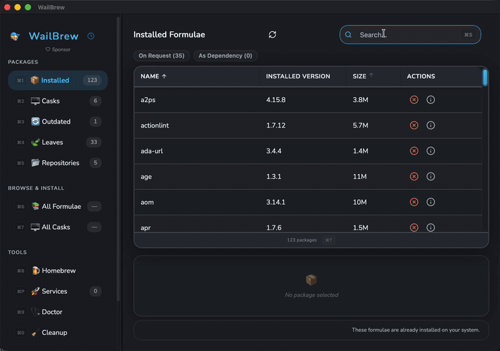
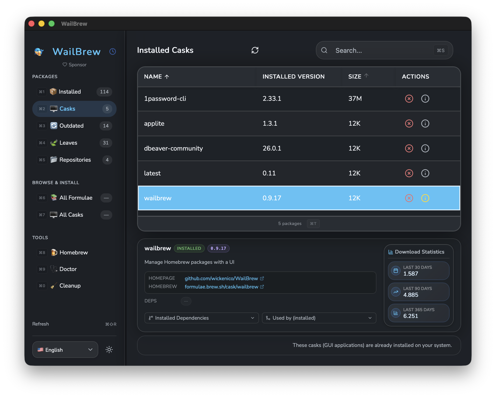

<p align="center">
  
</p>

<h1 align="center">WailBrew — Homebrew GUI Manager for macOS</h1>

<p align="center">
  A modern, native <strong>Homebrew GUI</strong> for macOS to install, update, and manage brew packages, casks, and services — an actively maintained, open-source <strong>Cakebrew alternative</strong>.
</p>

<p align="center">
  <a href="https://github.com/wickenico/WailBrew/releases/latest"></a>
  <a href="https://github.com/wickenico/WailBrew/releases"></a>
  <a href="https://github.com/wickenico/WailBrew/stargazers"></a>
  
  <a href="LICENSE"></a>
  <br>
  <a href="https://github.com/sponsors/wickenico"></a>
  <a href="https://ko-fi.com/wickenico"></a>
  <a href="https://paypal.me/nicowickersheim"></a>
</p>

<p align="center">
  
</p>

## ⚡ Quick Install

```bash
brew install --cask wailbrew
```

Prefer a direct download? Grab the **[latest release](https://github.com/wickenico/WailBrew/releases/latest)**. See [Installation](#-installation) for details.

---

## 📖 Table of Contents

- [Quick Install](#-quick-install)
- [About](#-about)
- [Why WailBrew?](#-why-wailbrew)
- [Features](#-features)
- [Screenshots](#-screenshots)
- [Installation](#-installation)
- [Uninstall](#-uninstall)
- [Requirements](#-requirements)
- [WailBrew vs. Cakebrew](#-wailbrew-vs-cakebrew)
- [Localizations](#-localizations)
- [FAQ](#-faq)
- [Featured In](#-featured-in)
- [Sponsor](#-sponsor)
- [Contributing](#-contributing)
- [Troubleshooting & Support](#-troubleshooting--support)
- [License](#-license)
- [Acknowledgments](#-acknowledgments)

## 🍺 About

**WailBrew** is a modern and intuitive **graphical interface for [Homebrew](https://brew.sh)** on macOS. It makes package management accessible to everyone — no terminal required — while still giving power users full control over formulae, casks, taps, and services.

WailBrew was inspired by [Cakebrew](https://www.cakebrew.com/), bringing modern UI design and enhanced functionality to Homebrew package management. Built with [Wails](https://wails.io), Go, and React, it combines native performance with a beautiful, responsive interface.

Requests, Questions, Troubleshooting? => [r/WailBrew](https://www.reddit.com/r/WailBrew)

## ⭐ Why WailBrew?

- 🚀 **Native & fast** — a real macOS app built on Wails (Go + React), not a browser wrapper.
- 🍎 **Universal** — runs natively on both Apple Silicon and Intel Macs.
- 🧩 **Complete** — manages formulae, casks, taps, **and** services — not just packages.
- 🌍 **Localized** — a fully translated UI in **11 languages**.
- 🔒 **Signed & notarized** — distributed through the official Homebrew cask.
- 💚 **Actively maintained & open source** — MIT licensed, with regular releases.

## ✨ Features

**📦 Package management**
- Browse and manage installed **formulae** and **casks**
- Instant search and filtering across all packages
- **Install, uninstall, and upgrade** — individually, in bulk (multi-select), or all at once
- View detailed package info, including **dependencies and dependents**
- **Leaves** view to find packages you can safely remove

**🔄 Updates**
- Check for outdated packages and update them individually or all at once
- **Background update checks** with a **Dock badge** showing available updates
- Configurable outdated-check flags (e.g. include greedy cask updates)

**🗄️ Taps & repositories**
- List, **tap**, and **untap** repositories
- Trust untrusted taps and view tap info

**⚙️ Homebrew Services**
- List all services and their status
- **Start, stop, restart, and run** services directly from the UI

**🩺 Maintenance**
- Built-in **`brew doctor`** with deprecated-formula detection
- **Cleanup** with dry-run preview before removing old versions and caches
- **Brewfile export** (`brew bundle dump`)
- Self-manage Homebrew itself (`brew update`, version info)

**🎛️ Power-user extras**
- **Command palette** and keyboard shortcuts
- **Light / dark mode** synced with macOS appearance
- **Proxy** and **mirror source** support (including China mirrors) for faster, restricted-network installs
- Custom brew path with architecture auto-detection, custom cask options, no-quarantine toggle, auto-relaunch & auto-cleanup after upgrades
- Session logging for transparency into every command run

## 📸 Screenshots



<!-- PLACEHOLDER: add a few more screenshots to showcase breadth. Suggested shots:
     images/screenshot-services.png (Services view)
     images/screenshot-doctor.png   (Doctor view)
     images/screenshot-dark.png     (Dark mode)
     Uncomment and adjust the lines below once the files exist. -->
<!--


-->

## 📥 Installation

📦 **Installation via Homebrew (recommended):**

```bash
brew install --cask wailbrew
```

Or **[download the latest version](https://github.com/wickenico/WailBrew/releases/latest)** directly from GitHub Releases.

## 🗑️ Uninstall

```bash
brew uninstall --cask wailbrew
```

## 💻 Requirements

WailBrew supports the following macOS versions:

- **Apple Silicon (ARM):** macOS 11.0 (Big Sur) and later
- **Intel:** macOS 11.0 (Big Sur) and later

[Homebrew](https://brew.sh) must be installed. While the app is primarily tested on the latest macOS versions, we strive to maintain compatibility with older supported versions. If you encounter any issues on your macOS version, please let us know by [opening an issue](https://github.com/wickenico/WailBrew/issues) or providing feedback.

## 🆚 WailBrew vs. Cakebrew

WailBrew is inspired by Cakebrew and aims to be a modern, actively maintained successor.

| | **WailBrew** | **Cakebrew** |
|---|:---:|:---:|
| Manage formulae | ✅ | ✅ |
| Manage casks | ✅ | ⚠️ Limited |
| Homebrew **services** management | ✅ | ❌ |
| `brew doctor` & cleanup | ✅ | ⚠️ Partial |
| Apple Silicon native | ✅ | ✅ |
| Localized UI (11 languages) | ✅ | ❌ |
| Light / dark mode | ✅ | ⚠️ |
| Actively maintained | ✅ | ❌ |
| Open source | ✅ (MIT) | ✅ |

## 🌍 Localizations

WailBrew ships with a **fully translated UI** in the following languages:

- 🇺🇸 English
- 🇩🇪 German
- 🇫🇷 French
- 🇹🇷 Turkish
- 🇨🇳 Chinese (Simplified)
- 🇹🇼 Chinese (Traditional)
- 🇧🇷 Português do Brasil
- 🇷🇺 Russian
- 🇰🇷 Korean
- 🇮🇱 Hebrew
- 🇪🇸 Spanish

Want to see WailBrew in your language? Contributions are welcome — [open a Pull Request](https://github.com/wickenico/WailBrew/pulls) or [create an Issue](https://github.com/wickenico/WailBrew/issues). See [CONTRIBUTING.md](CONTRIBUTING.md) for the translation guide.

## ❓ FAQ

**Is WailBrew free?**
Yes. WailBrew is completely free and open source under the MIT license.

**Does it work on Apple Silicon (M1/M2/M3/M4)?**
Yes — WailBrew runs natively on both Apple Silicon and Intel Macs.

**Do I still need Homebrew installed?**
Yes. WailBrew is a graphical front-end for Homebrew, so `brew` must be installed. WailBrew auto-detects the brew path for your architecture.

**How is WailBrew different from Cakebrew?**
WailBrew is an actively maintained, modern alternative with cask and services management, a localized UI in 11 languages, light/dark mode, and native Apple Silicon support. See the [comparison above](#-wailbrew-vs-cakebrew).

**Does WailBrew run my commands safely?**
Yes — WailBrew simply calls the `brew` CLI. Every command is transparent, and session logging lets you see exactly what runs.

**Is it available for Linux or Windows?**
WailBrew targets macOS. There is partial Linux support; see the troubleshooting note below.

## 📰 Featured In

WailBrew has been featured by a number of publications and communities:

- <a href="https://www.howtogeek.com/best-free-mac-utilities-that-actually-make-a-difference/" target="_blank" rel="noopener noreferrer">How-To Geek</a>
- <a href="https://talk.macpowerusers.com/t/wailbrew-new-homebrew-gui-manager" target="_blank" rel="noopener noreferrer">Mac Power Users</a>
- <a href="https://www.ifun.de/wailbrew-einfache-grafische-oberflaeche-fuer-homebrew-266778/" target="_blank" rel="noopener noreferrer">iFun</a>
- <a href="https://alternativeto.net/software/wailbrew/about/" target="_blank" rel="noopener noreferrer">AlternativeTo</a>

<details>
<summary>See more coverage</summary>

- <a href="https://vvmac.com/wordpress_b/wailbrew-pare-homebrew-dune-interface-graphique/" target="_blank" rel="noopener noreferrer">VVMac</a>
- <a href="https://softwareontheweb.com/product/wailbrew" target="_blank" rel="noopener noreferrer">Software on the web</a>
- <a href="https://madewithreactjs.com/wailbrew" target="_blank" rel="noopener noreferrer">Made with ReactJS</a>
- <a href="https://tom-doerr.github.io/repo_posts/" target="_blank" rel="noopener noreferrer">Tom Doerr Repository Showcase</a>
- <a href="https://medium.com/macoclock/10-super-niche-mac-apps-that-completely-transformed-my-mac-ee0671c693bc" target="_blank" rel="noopener noreferrer">Medium</a>
- <a href="https://www.sir-apfelot.de/5-app-empfehlungen-im-november-2025-67869/" target="_blank" rel="noopener noreferrer">Sir Apfelot</a>
- <a href="https://mac-utils.com/wailbrew/" target="_blank" rel="noopener noreferrer">Mac Utils</a>
- <a href="https://brandonvisca.com/wailbrew-interface-graphique-homebrew/" target="_blank" rel="noopener noreferrer">Brandon Visca</a>
- <a href="https://www.apfeltalk.de/magazin/news/dieser-neue-texteditor-koennte-nano-auf-linux-und-macos-abloesen/" target="_blank" rel="noopener noreferrer">Apfeltalk</a>
- <a href="https://www.macgadget.de/index.php/News/2025/10/24/Ticker-Guenstige-Aqara-Sicherheitskamera-mit-HomeKit-Steinberg-und-macOS-26-FRITZOS" target="_blank" rel="noopener noreferrer">Mac Gadget</a>
- <a href="https://macked.app/wailbrew-homebrew.html" target="_blank" rel="noopener noreferrer">Macked</a>

</details>

## ❤️ Sponsor

WailBrew is free and open source, built and maintained in my spare time. Sponsorship helps cover the Apple Developer Program membership (\$99/year, required for code signing & notarization) and funds time for new features like Brewfile import, native notifications, and faster large-list performance.

If WailBrew saves you time, please consider supporting its development:

- ☕ **[Buy me a coffee on Ko-fi](https://ko-fi.com/wickenico)** — one-time tip
- 💳 **[PayPal](https://paypal.me/nicowickersheim)** — one-time donation
- 💖 **[GitHub Sponsors](https://github.com/sponsors/wickenico)** — recurring support

Every contribution, big or small, is genuinely appreciated and helps keep WailBrew maintained. 🙏

## 🛠️ Contributing

Interested in contributing to WailBrew? We welcome contributions of all kinds!

- **Code contributions**: Bug fixes, features, improvements
- **Translations**: Help localize WailBrew to more languages
- **Bug reports**: Found an issue? Let us know
- **Feature requests**: Have an idea? We'd love to hear it

Please see [CONTRIBUTING.md](CONTRIBUTING.md) for detailed development setup, how to build from source, and contribution guidelines.

## 🐛 Troubleshooting & Support

### Common Issues
- **Linux running problem**: Check this [post](https://github.com/wickenico/WailBrew/issues/138#issue-3660201918) from [dsmyth](https://github.com/dsmyth), thank you!
- **Homebrew not found**: Ensure Homebrew is correctly installed
- **Permission errors**: May need to run the app with appropriate permissions
- **Slow performance**: Close other resource-intensive applications

### Support

For issues, feature requests, or questions:
- Visit [r/WailBrew](https://www.reddit.com/r/WailBrew) for community support
- Check [existing issues](https://github.com/wickenico/WailBrew/issues) on GitHub
- Create a [new issue](https://github.com/wickenico/WailBrew/issues/new) if needed
- See [CONTRIBUTING.md](CONTRIBUTING.md) for more details on reporting bugs

## 📝 License

This project is licensed under the MIT License. See [LICENSE](LICENSE) for details.

## 🏆 Acknowledgments
- [Wails](https://wails.io) community for the framework
- [Cakebrew](https://www.cakebrew.com/) as inspiration

---

<p align="center">
  <strong>WailBrew</strong> makes Homebrew management simple and accessible for all macOS users.<br>
  Try it out and streamline your package management workflow! 🍺
</p>
